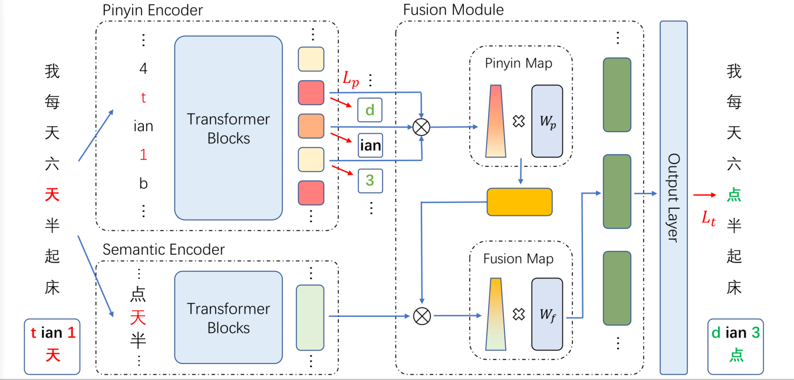

# PYGC: a PinYin Language Model Guided Correction Model for Chinese Spell Checking
Data and source code for ICONIP2023 submission "PYGC: a PinYin Language Model Guided Correction Model for Chinese Spell Checking"  

## Requirements
- python 3.8
- transformers 4.12.5
- pytorch-lightning 1.5.1
- pypinyin

## Data
Download the SIGHAN and CSCD-IME dataset from Baidu Netdisk and unzip it as folder "PYGC/data/"：  
Link: https://pan.baidu.com/s/1F6gaQfcglwH5j61t3rN0vw Password：1ne9   

## Finetuneing
You can directly finetune the model using:  
`bash train.sh`  

## Inference
You can modify some parameters in 'predict.sh' and run this file to predict:  
`bash predict.sh`

## Note
More results of experiments will be put into this repository in one week.
